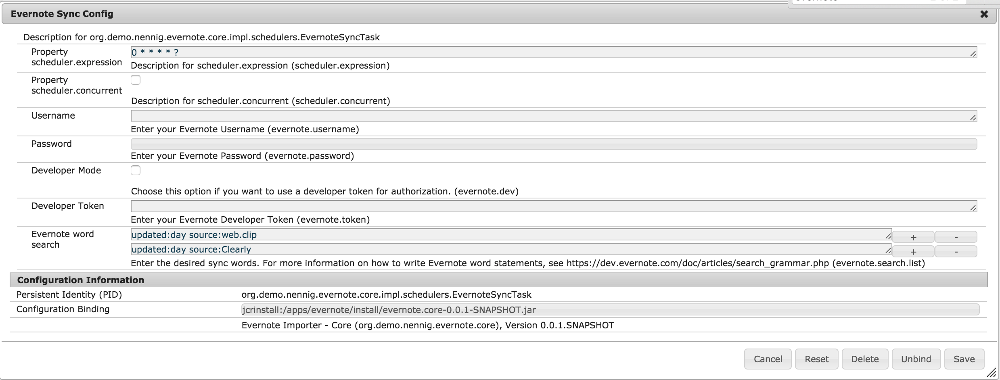

# Evernote Import into AEM Project

Evernote: [https://evernote.com/](https://evernote.com/)

This is a proof of concept project. I wanted to be able to show how easily you can create custom importers or sync tools into the JCR.

Any Evernote notes made with the [Evernote Web Clipper](https://evernote.com/webclipper/) within the last day will automatically be imported into /dam/evernote/<guid of the note> as an asset.
This can be modified in the OSGi configurations of this project. Potentially anything form Evernote can be synced.

You need to use a production Evernote dev token in order to access the Evernote account that's connected to the Web Clipper.

## How to use
1. Start AEM
  * cmd example: $ java -agentlib:jdwp=transport=dt_socket,server=y,suspend=n,address=10123 -jar aem-author-4502.jar -p 4502 -r author -nofork -gui
2. [Install this project via maven](README.md#how-to-build)
   * Or you can install the [UI Content Package](ui.content/target/evernote.ui.content-0.0.1-SNAPSHOT.zip) and [UI Apps Package](ui.apps/target/evernote.ui.apps-0.0.1-SNAPSHOT.zip) via [Package Manager](http://localhost:4502/crx/packmgr/index.jsp)
3. Setup a [production Evernote dev token](https://dev.evernote.com/doc/articles/dev_tokens.php)
4. In system/console/configMgr setup the configuration called "Evernote Configuration"
   * Check developer mode
   * Add your dev token
5. Add some notes to your Evernote via webclipper
	* Note images are currently not supported from Evernote
6. Observe the notes being imported into AEM [content/dam/evernote-sync](http://localhost:4502/assets.html/content/dam/evernote-sync)
7. Open [content/evernote/en.html](http://localhost:4502/editor.html/content/evernote/en.html)
   * Add the Evernote component to the page
   * In the assetfinder change the group to "Evernote"
   * Drag and drop an Evernote Asset onto the page

## Modules

The main parts are:

* core: Java code to create the import from Evernote. 
	* The demo of this project is for Evernote Clipper, but using the OSGi configs, you can sync anything from Evernote

     * [Download Evernote Web Clipper](https://evernote.com/webclipper/)
	
 * Note: Currently authentication is only supported by developer key.

	 * [Get an Evernote dev token](https://dev.evernote.com/doc/articles/dev_tokens.php)
 
 * OSGi Configurations:
 
 

* ui.apps:
 * The main component is components/content/note-viewer
   * Once Evernote assets are imported, they can be added to the evernote component via the AssetFinder under the group called "Evernote"
 * config nodes for custom logs, service user mapping, and this projects config
* ui.content: A basic website to use the Evernote component

## How to build

To build all the modules run in the project root directory the following command with Maven 3.2.5:

    mvn clean install

If you have a running AEM instance you can build and package the whole project and deploy into AEM with  

    mvn clean install -PautoInstallPackage
    
Or to deploy it to a publish instance, run

    mvn clean install -PautoInstallPackagePublish
    
Or to deploy only the bundle to the author, run

    mvn clean install -PautoInstallBundle

## Maven settings

The project comes with the auto-public repository configured. To setup the repository in your Maven settings, refer to:

    http://helpx.adobe.com/experience-manager/kb/SetUpTheAdobeMavenRepository.html
   
## Future Goals
* Implement OAuth for authentication
* Note updates from Evernote
* Multiple Evernote Accounts to connect
* basic image import from Evernote
* Ability to preview the imported Evernote note in /assets.html
 * Same preview image available in the assetfinder as a thumbnail
